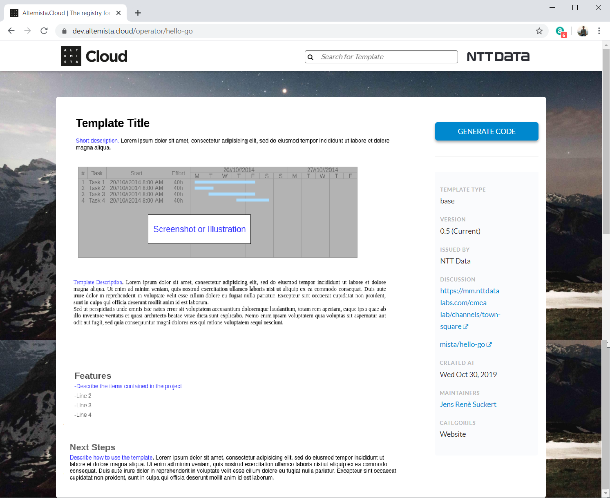

# GUIDELINES FOR TEMPLATE CREATION

## Layout

The presentation of a template in the developer portal are supposed to follow these guidelines to achieve a common look & feel.

Every template should provide the following sections:
* Title - Name of template
* Shortdescription - A short sentence describing the template contents
* Screenshot - A visual description of the project. This could be a picture of the running application or an architectual illustration
* Description - A long description of the purpose of the template
* Features - A bullet point list of all contents or functions of the project
* Next steps - A description how to continue after code generation. E.g. how to compile the code



## Categories

The categories should not be randomly taken, but rather be choosen out of the given list. Contributions are important as this list must evolve over time.

Existing Categories:
* Website
* CI/CD

If you want to add a new category to the upper list, please open a PR for this file.

## Commands

- When using git clone, the repository should be cloned in the current working directory, **not** a subdirectory, also to avoid confusion, the `.git` subdirectory should be deleted after cloning.
  ```bash
    git clone <repository-url> . && rm -rf .git
  ```
